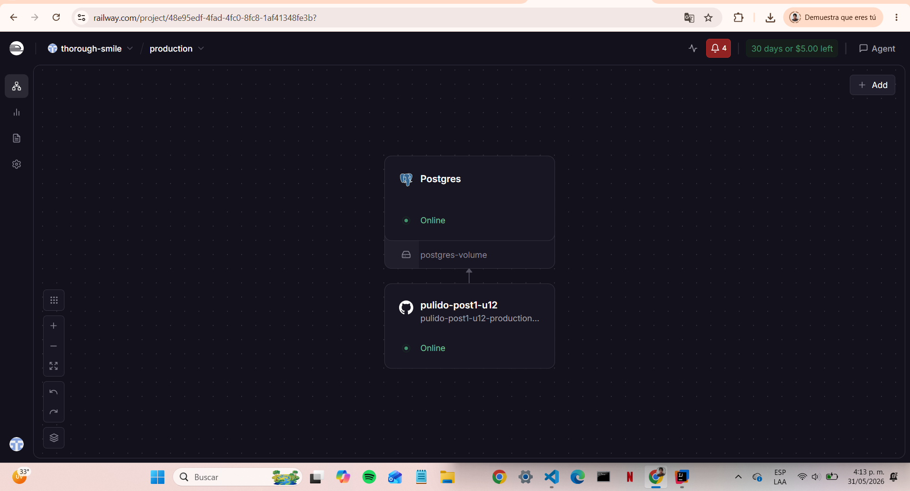

# Catálogo de Productos — Post-Contenido 1, Unidad 12

Contenedorización de la aplicación Spring Boot con **Dockerfile multi-stage**, orquestación local con **Docker Compose** + PostgreSQL, y despliegue en **Railway**.

---

## Aplicación desplegada en Railway
https://pulido-post1-u12-production.up.railway.app

Endpoints públicos:
- `GET /actuator/health` → estado de la aplicación
- `GET /api/productos` → lista de productos
- `POST /api/productos` → crear producto

---

## Prerrequisitos

- Java 17 o superior
- Maven 3.9.x
- Docker Desktop instalado y corriendo

---

## Clonar el repositorio

```bash
git clone https://github.com/TU_USUARIO/pulido-post1-u12.git
cd pulido-post1-u12/catalogo
```

---

## Parte 1: Construir la imagen Docker localmente

```bash
docker build -t mi-app:local .
```

Verificar que la imagen se creó correctamente:

```bash
docker images
```

La imagen `mi-app` debe aparecer con un tamaño inferior a 300 MB.

---

## Parte 2: Ejecutar con Docker Compose

Levanta la aplicación junto con PostgreSQL:

```bash
docker compose up -d --build
```

Verificar que ambos contenedores están corriendo:

```bash
docker compose ps
```

Debe mostrar `catalogo-app-1` y `catalogo-db-1` en estado `Up`.

Verificar que la aplicación responde:
GET http://localhost:8080/actuator/health

Respuesta esperada: `{"status":"UP"}`

Detener los contenedores:

```bash
docker compose down
```

---

## Variables de entorno requeridas

| Variable | Descripción | Ejemplo |
|----------|-------------|---------|
| `SPRING_PROFILES_ACTIVE` | Perfil de Spring Boot | `prod` |
| `DATABASE_URL` | URL de conexión PostgreSQL | `jdbc:postgresql://host:5432/db` |
| `DB_USER` | Usuario de la base de datos | `appuser` |
| `DB_PASS` | Contraseña de la base de datos | `apppass` |

En Railway se configuran así usando referencias automáticas:

| Variable | Valor en Railway |
|----------|-----------------|
| `SPRING_PROFILES_ACTIVE` | `prod` |
| `DATABASE_URL` | `${{Postgres.DATABASE_URL}}` |
| `DB_USER` | `${{Postgres.PGUSER}}` |
| `DB_PASS` | `${{Postgres.PGPASSWORD}}` |

---

## Parte 3: Despliegue en Railway

1. Iniciar sesión en [railway.app](https://railway.app) con GitHub
2. Crear nuevo proyecto → **Deploy from GitHub repo** → seleccionar `pulido-post1-u12`
3. En **Settings** del servicio → **Root Directory** → escribir `catalogo`
4. Agregar base de datos: **+ New** → **Database** → **Add PostgreSQL**
5. En **Variables** del servicio agregar las 4 variables de la tabla anterior
6. En **Settings** → **Networking** → **Generate Domain**
7. Esperar el redepliegue automático

---

## Estructura del proyecto

pulido-post1-u12/
└── catalogo/
├── Dockerfile                          ← multi-stage: JDK builder + JRE producción
├── .dockerignore
├── docker-compose.yml                  ← orquesta app + PostgreSQL
├── pom.xml
└── src/
└── main/
└── resources/
├── application.properties          ← perfil desarrollo (H2)
└── application-prod.properties     ← perfil producción (PostgreSQL)

---

## Dockerfile — estrategia multi-stage
Etapa 1 (builder): eclipse-temurin:21-jdk-alpine + Maven
→ compila el proyecto y genera el JAR
Etapa 2 (producción): eclipse-temurin:21-jre-alpine
→ solo copia el JAR, sin herramientas de desarrollo
→ usuario no root (spring) por seguridad
→ tamaño final < 300 MB

## Evidencias de los Checkpoints

### Checkpoint 1 — Imagen Docker construida localmente
`docker build -t mi-app:local .` finaliza con éxito y `docker images` muestra la imagen con tamaño inferior a 300 MB.


### Checkpoint 2 — Docker Compose con PostgreSQL
`docker compose up -d --build` levanta ambos servicios. `docker compose ps` muestra `catalogo-app-1` y `catalogo-db-1` en estado `Up/healthy`. `GET http://localhost:8080/actuator/health` retorna `{"status":"UP"}`.

### Checkpoint 3 — Despliegue en Railway
Aplicación desplegada en `https://pulido-post1-u12-production.up.railway.app` con PostgreSQL conectado. `/actuator/health` retorna `{"status":"UP"}` y `/api/productos` retorna **200 OK**.

